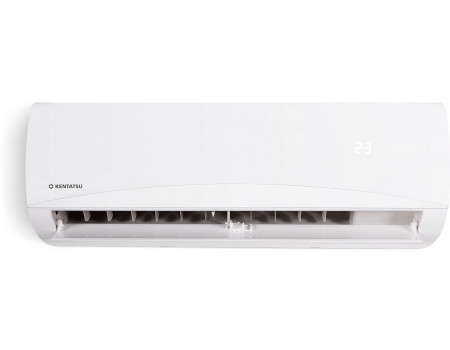
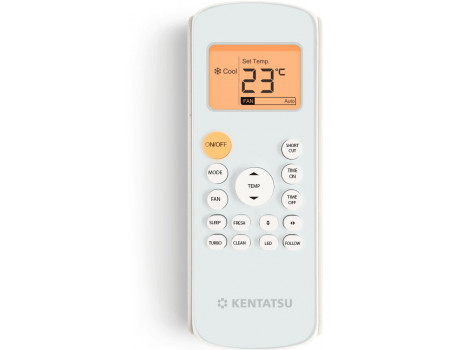

# Управление кондиционером Kentatsu KSGB35





## Прошивка Arduino NodeMCU v1 (esp8266)

Пример
```
#B27BE0 = [[REMOTE OFF AC]]
10110010_011_11011_1110_00_00

#B2BFC0 = [[JUST ON]] = MODE COOL | FAN AUTO | TEMP 25
10110010_101_11111_1100_00_00

irsend.sendCOOLIX(0xB2BFC0);
```

## Html для генерации IR кода


## Описание протокола
Есть три значения 
0 - 532
1 - 1623
2 - 4578

Формат сообщения 
22(код2)222(код2)

тут "код2" это полезные данные, код кнопки пульта

код2 это код1 только перед каждым символом есть "0"
пример: 0100010100000100000100000101000100010101010001010100000000010000010101000000000000000001010101010
код 1 это бинарные данные
пример: 101100100100110101111011100001001110000000011111

итоговый Raw данные для отправки на ардуино это "Формат сообщения" с заменой на "три значения"
